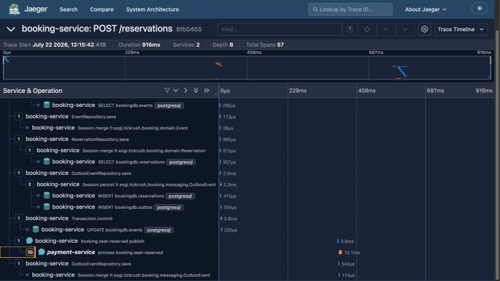
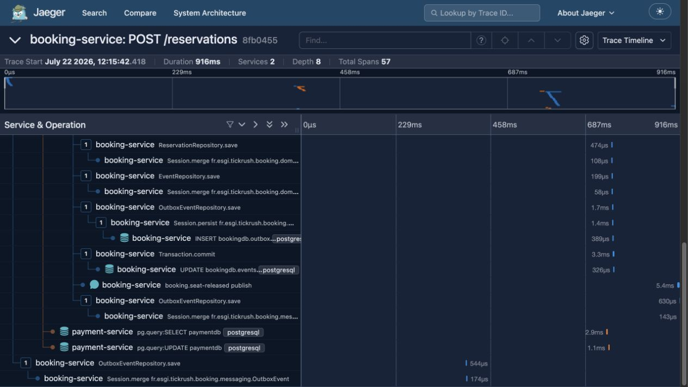

# TickRush — Billetterie événementielle

Projet fil rouge — Module *Architecture Microservices*, 4ESGI-AL (2025-2026).

**Sujet 2 — TickRush** : vente de billets pour des événements à **stock limité**. La
contrainte centrale : ne **jamais** vendre plus de places qu'il n'en existe, même sous
forte charge, et ne jamais dupliquer ni perdre un paiement.

**Auteurs** : Alexandru Rusescu · Fethi Sedjai

**Organisation** : réalisation à deux auteurs, explicitement autorisée par le formateur.

---

## User stories minimales (démontrées en soutenance)

1. **Je réserve N places** pour un événement : le stock est décrémenté de manière **sûre**
   — deux clients ne peuvent pas obtenir la même place (concurrence maîtrisée).
2. **Si je ne paie pas dans le délai** (réservation non payée en 2 min), mes places sont
   **remises en vente** automatiquement (expiration / TTL).
3. **Après paiement, mon billet est émis** — et un même paiement rejoué n'émet jamais deux
   billets (idempotence du consommateur).

## Capacités métier (verbes métier — matière première de l'Event Storming, séance 2)

- **Consulter** les événements disponibles et le stock restant
- **Réserver** N places pour un événement
- **Payer** une réservation dans le délai imparti
- **Émettre / consulter** son billet après paiement
- **Expirer** une réservation non payée → **libérer** les places (remise en vente)
- **Annuler automatiquement** une réservation après un paiement refusé → **libérer** les places
- **Notifier** la confirmation par « email » simulé _(bonus : notification-service)_

---

## Architecture cible

| Service | Langage | Rôle |
|---|---|---|
| `booking-service` | Java / Spring Boot 3.5 (JDK 21) | Réservation, stock, TTL, billet et compensation idempotente |
| `payment-service` | Node.js / TypeScript (NestJS 11) | Consumer `SeatReserved`, paiement persistant, résultat et DLQ |
| `notification-service` | Python / FastAPI | Consumer des faits finaux et emails MailDev — _bonus, 3ᵉ langage_ |

**Endpoints REST** (détails dans [docs/decoupage.md](docs/decoupage.md)) :
- booking : `POST /reservations`, `GET /reservations/{id}`, `GET /reservations/{id}/payment-status`, `GET /events/{id}`
- payment : `POST /payments`, `GET /payments/by-reservation/{id}/status`

**Communication inter-services** : le flux métier principal est désormais asynchrone.
`booking-service` publie `SeatReserved`, `payment-service` l'encaisse puis répond par
`PaymentReceived` ou `PaymentFailed`; `booking-service` émet alors le billet ou restaure le
stock. `notification-service` reçoit les faits finaux. Les pods joignent Kafka par le DNS
Kubernetes `kafka:29092`. L'appel HTTP protégé par circuit breaker reste un endpoint de
consultation du statut et démontre la résilience synchrone du TP3.

**Patterns avancés retenus** : **saga chorégraphiée** avec compensation du stock, TTL et
idempotence transactionnelle, puis **Transactional Outbox** dans les deux services
producteurs. Les décisions sont justifiées dans
[`ADR-001`](docs/adr/001-choregraphie-vs-orchestration.md) et
[`ADR-002`](docs/adr/002-transactional-outbox.md).

### État fonctionnel après le TP8

- Réservation et décrément du stock atomiques, verrou optimiste avec retries bornés et test
  concurrent de non-survente.
- Paiement persistant et idempotent, y compris en cas de requêtes concurrentes.
- Appel HTTP inter-services protégé par timeout, circuit breaker et fallback métier.
- Kafka KRaft, Kafka UI, 6 topics métier et 5 topics morts à 3 partitions.
- Chemin nominal `SeatReserved → PaymentReceived → TicketIssued`, avec `ticketId` persistant.
- Chemin compensé `SeatReserved → PaymentFailed → SeatReleased`; le stock avant/après est
  identique et un rejeu ne libère jamais deux fois.
- Expiration automatique `PENDING → EXPIRED`, restauration du stock et refus d'un encaissement
  arrivé après `expiresAt`.
- Déduplication `processed_events` atomique avec l'effet métier, testée par rejeu du même
  `eventId`.
- Trois traitements bornés puis DLQ/DLT des deux côtés; un poison pill ne bloque pas la suite.
- Notification Kafka des billets et expirations, capturée dans MailDev.
- Tables `outbox` privées dans `booking-db` et `payment-db`; donnée métier et événement sont
  validés par le même commit PostgreSQL.
- Relayeurs à polling de 500 ms, `acks=all`, ordre d'insertion et marquage `published_at`
  uniquement après l'ACK Kafka.
- Publication at-least-once couplée à l'Inbox `processed_events` : aucune perte et un seul
  effet métier malgré un éventuel doublon.
- Métriques Prometheus sur `/actuator/prometheus` et `/metrics`, avec cibles applicatives
  contrôlées `UP`.
- Dashboard Grafana provisionné avec les quatre signaux Rate, Errors, Duration p95 et lag
  Kafka.
- Traces OpenTelemetry exportées vers Jaeger par agents Java et Node, avec propagation W3C
  conservée à travers Kafka et les deux Outbox.
- Logs JSON Logback/Pino corrélés par `trace_id` et `span_id`.

La saga et sa version orchestrée sont détaillées dans [`docs/saga.md`](docs/saga.md). La
preuve de panne Outbox est reproductible avec `task tp7:outbox`; la preuve d'observabilité
complète avec `task tp8:demo`.

---

## Déploiement

> **Note.** L'énoncé mentionne `docker compose up`. Pour ce projet, le déploiement se fait
> sur **k3s** (Kubernetes), option **validée par le formateur** en remplacement de Docker
> Compose. Les manifests suivent la convention du lab : un dossier par service sous `k3s/`
> (`deployment` / `service` / `ingress` / `pvc`), Traefik en ingress, namespaces centralisés.

### Démarrage rapide (Taskfile)

Le plus simple : un [`Taskfile.yml`](Taskfile.yml) orchestre tout ([go-task](https://taskfile.dev) — `brew install go-task`).

```bash
task up          # cluster k3d + build + import images + déploiement complet
task status      # pods / services / ingress
task test        # tests Java, Jest, FastAPI, lint et builds
task smoke       # scénario nominal TP7 via l'Ingress, les Outbox et Kafka
task tp5:demo    # pipeline complet + preuve du rejeu idempotent
task tp5:poison  # 3 tentatives puis DLQ Node et DLT Java
task tp5:rejection # paiement à 149,70 EUR refusé de façon déterministe
task tp6:demo    # succès + compensation mesurée + rejeu idempotent
task tp6:ttl     # expiration et remise en stock, configuration restaurée ensuite
task tp6:chaos   # reprise automatique après arrêt du payment-service
task tp7:outbox  # Kafka arrêté : POST 201, Outbox en attente, puis rattrapage sans perte
task tp8:demo    # métriques, dashboard, trace Kafka/compensation et logs JSON corrélés
task demo:reset  # remettre stocks, réservations et paiements à zéro (avec confirmation)
task front       # console de démo React (http://localhost:5173)
task kafka:topics        # lister et décrire les 11 topics
task kafka:produce-demo  # produire 10 messages avec 3 clés
task kafka:consume-demo  # afficher clé, partition et offset
task kafka:lag-demo      # créer puis observer le lag d'un groupe
task kafka:ui            # Kafka UI (http://localhost:8090)
task forward     # services, DBs, MailDev, Prometheus, Grafana et Jaeger en arrière-plan
task unforward   # les fermer tous
task redeploy    # rebuild + redéploiement après une modif de code
task stop        # éteindre le cluster (données conservées) — task start pour rallumer
task             # liste toutes les commandes
```

Les sections ci-dessous détaillent les étapes manuelles équivalentes.

### Kafka - TP4

Kafka utilise deux listeners : `INTERNAL` annonce `kafka:29092` aux pods du cluster;
`EXTERNAL` annonce `localhost:9092` aux clients du poste via `task kafka:forward`. Les
adresses annoncées doivent être réellement joignables par le client Kafka.

Les six topics métier et les cinq topics morts sont créés par le Job `kafka-init` depuis le script versionné
[`k3s/kafka/create-topics.sh`](k3s/kafka/create-topics.sh), avec **3 partitions** et un
facteur de réplication **RF=1**. Trois partitions autorisent au maximum trois consommateurs
actifs dans un même groupe. RF=1 est uniquement acceptable pour ce cluster local mono-broker;
en production, la perte du broker supprimerait la disponibilité et pourrait perdre les
données, donc il faudrait plusieurs brokers et typiquement RF=3.

Une même clé Kafka est toujours dirigée vers la même partition : les offsets y augmentent et
l'ordre est conservé. `CURRENT-OFFSET` est le marque-page du groupe, `LOG-END-OFFSET` la fin
du journal et `LAG` leur différence. Lorsqu'un membre d'un groupe s'arrête, Kafka réattribue
ses partitions aux survivants lors d'un **rebalance**. Deux groupes distincts lisent chacun
la totalité des événements, indépendamment l'un de l'autre.

**Observation vérifiée dans k3s** : les 10 messages de démonstration ont été relus deux fois
depuis l'offset 0. Après une consommation limitée à 3 messages, le lag total mesuré était de
7. Avec deux membres dans `tickrush-rebalance-demo`, le premier détenait les partitions 0 et
1 et le second la partition 2; après arrêt du second, le survivant a récupéré les partitions
0, 1 et 2.

Le protocole complet de démonstration et les clés choisies par événement sont documentés dans
[`docs/tp04-kafka.md`](docs/tp04-kafka.md) et [`docs/decoupage.md`](docs/decoupage.md).

### Pipeline événementiel - TP5

Le contrat commun contient `eventId`, `eventType`, `occurredAt`, `aggregateId` et `payload`.
Pour le cycle de paiement, `aggregateId` et la clé Kafka valent `reservationId`; l'identifiant
du concert ou match reste `payload.eventId`. Le prix unitaire est figé dans la réservation et
le montant vaut `unitPrice × quantity`.

```bash
task tp5:demo    # crée, attend le résultat, rejoue PaymentReceived, vérifie processed_events=1
task tp5:poison  # injecte deux JSON invalides et contrôle les topics morts
task tp5:rejection # prépare le chemin d'échec de la saga TP6
```

À la frontière du TP05, le consumer Java insérait l'`eventId` dans `processed_events` et
passait la réservation à `PAID` dans la même transaction PostgreSQL. Côté Node comme côté Java, trois échecs conduisent
à `booking.seat-reserved.DLQ` ou `payment.received.DLT`, puis l'offset suivant peut être traité.
Le protocole détaillé est dans [`docs/tp05-pipeline.md`](docs/tp05-pipeline.md).

### Démo saga chorégraphiée - TP6

```bash
task tp6:demo   # chemin heureux, compensation, stock avant/après et rejeu
task tp6:ttl    # TTL accéléré à 5 s pour la preuve, puis retour automatique à 120 s
task tp6:chaos  # arrêt du paiement, réservation, redémarrage et reprise Kafka
```

Le succès termine à `TICKET_ISSUED`; un refus termine à `CANCELLED`; un timeout termine à
`EXPIRED`. `CANCELLED` et `EXPIRED` restaurent les places dans une transaction locale avant
de publier `SeatReleased`. Le marker `processed_events`, les verrous de réservation et les
transitions métier rendent étapes et compensations idempotentes. Le service Python consomme
`TicketIssued` et `ReservationExpired`, puis envoie les emails vers MailDev. Cette notification
bonus est volontairement **at-least-once** : un crash après l'envoi SMTP mais avant le commit de
l'offset peut dupliquer un email, sans dupliquer le paiement, le billet ni la compensation.

### Transactional Outbox - TP7

`booking-service` ne publie plus directement après son commit. Il écrit chaque enveloppe
dans `booking-db.outbox` avec la réservation, le billet ou la compensation. De même,
`payment-service` écrit le paiement et son résultat dans `payment-db.outbox` dans une seule
transaction TypeORM. Les relayeurs publient ensuite vers Kafka et renseignent
`published_at` seulement après l'ACK.

La démonstration demandée par le TP est entièrement scriptée pour k3s :

```bash
task tp7:outbox
```

Le script exécute et vérifie automatiquement les étapes suivantes :

1. Il scale le Deployment Kafka à zéro.
2. Il appelle `POST /reservations` et exige une réponse `201` avec un stock décrémenté.
3. Il interroge PostgreSQL et prouve que la réservation existe tandis que `SeatReserved`
   possède encore `published_at IS NULL`.
4. Il relance Kafka sans effectuer de nouvel appel client.
5. Il attend `TICKET_ISSUED`, puis vérifie les Outbox `SeatReserved`, `PaymentReceived` et
   `TicketIssued`, l'Inbox `processed_events=1` et le stock décrémenté une seule fois.

Un `trap` restaure Kafka même si une assertion échoue. La publication est at-least-once :
un crash après l'ACK et avant le marquage peut republier, mais les consommateurs idempotents
neutralisent ce doublon. Le choix et ses coûts sont détaillés dans
[`ADR-002`](docs/adr/002-transactional-outbox.md).

### Observabilité - TP8

Le TP8 reste **100 % k3s** : les services Compose demandés par l'énoncé sont remplacés par
les Deployments et ConfigMaps de [`k3s/observability`](k3s/observability). `task forward`
expose les interfaces locales suivantes :

| Outil | URL | Usage |
|---|---|---|
| Prometheus | `http://localhost:9090` | targets et requêtes PromQL |
| Grafana | `http://localhost:3001` (`admin/admin`) | dashboard `TickRush - RED et Kafka` |
| Jaeger | `http://localhost:16686` | traces distribuées de la saga |

Prometheus scrape `booking-service:8080/actuator/prometheus` et
`payment-service:3000/metrics` toutes les 5 secondes. Le dashboard Grafana est exporté sous
[`monitoring/grafana`](monitoring/grafana), puis injecté par Kustomize avec sa datasource :
il est recréé après chaque redémarrage, sans manipulation dans l'UI.

Les agents OpenTelemetry instrumentent HTTP, JDBC/pg et Kafka/Spring Kafka. L'Outbox crée
une frontière temporelle que l'auto-instrumentation seule ne peut pas franchir : TickRush
persiste donc `traceparent`, `tracestate` et `baggage` avec chaque événement, puis restaure ce
contexte avant le `send` Kafka. Une seule trace relie ainsi le POST initial, les deux bases,
les producteurs/consommateurs Kafka, le paiement et la compensation.

```bash
task redeploy
task forward
task tp8:demo
```

`task tp8:demo` redémarre Grafana, exige les deux targets Prometheus `UP`, contrôle les quatre
panneaux provisionnés, déclenche un succès et un refus, compare le `trace_id` des logs Java et
Node, puis interroge Jaeger et Prometheus. L'exécution de référence a produit une trace de
**57 spans**, **2 services** et **916 ms**, comprenant `booking.seat-reserved publish`,
`process booking.seat-reserved`, `send payment.rejected`, `payment.rejected process` et
`booking.seat-released publish`.

**Choix pour la soutenance : la trace Jaeger du chemin compensé.** Elle montre en une seule
vue la propagation Kafka, les transactions Outbox, le changement de langage et le retour de
compensation. La procédure est : `task forward`, `task tp8:demo`, lire le `trace_id` affiché,
puis le coller dans Jaeger.





Le protocole, les métriques et les requêtes du dashboard sont détaillés dans
[`docs/tp08-observabilite.md`](docs/tp08-observabilite.md).

### Tout déployer dans le cluster (démo de soutenance)

```bash
# 1. Cluster local (Traefik inclus dans k3s) — une seule fois
k3d cluster create tickrush --port "8081:80@loadbalancer" --port "8443:443@loadbalancer"

# 2. Construire et importer les images (pas de registry)
docker build -t tickrush/booking-service:dev ./booking-service
docker build -t tickrush/payment-service:dev ./payment-service
docker build -t tickrush/notification-service:dev ./notification-service
k3d image import tickrush/booking-service:dev tickrush/payment-service:dev \
  tickrush/notification-service:dev -c tickrush

# 3. Déployer d'abord les dépendances
kubectl apply -f k3s/namespace.yaml
kubectl apply -f k3s/booking-db/ -f k3s/payment-db/ -f k3s/maildev/
kubectl apply -k k3s/kafka/
kubectl apply -k k3s/observability/
kubectl -n tickrush rollout status deployment/kafka
kubectl -n tickrush wait --for=condition=complete job/kafka-init --timeout=180s

# 4. Déployer les 3 services une fois leurs dépendances prêtes
kubectl apply -f k3s/payment-service/ -f k3s/booking-service/ -f k3s/notification-service/
kubectl -n tickrush rollout status deployment/booking-service

# 5. Démontrer la saga via la façade Traefik
curl localhost:8081/events/11111111-1111-1111-1111-111111111111
task tp6:demo

# L'endpoint HTTP de paiement reste disponible pour le TP3 et le diagnostic
curl -X POST localhost:8081/payments -H 'Content-Type: application/json' \
  -d '{"reservationId":"<uuid>","amount":49.90}'
curl -X POST localhost:8081/notifications/ticket-issued -H 'Content-Type: application/json' \
  -d '{"to":"a@b.c","reservationId":"<uuid>","eventName":"Concert","quantity":2}'  # email

# Consulter les mails capturés (UI web MailDev)
kubectl -n tickrush port-forward svc/maildev 1080:1080   # → http://localhost:1080
```

## Lancement en développement local — booking-service

Prérequis : JDK 21+ (le projet cible Java 21 ; testé sur JDK 24), Docker + `k3d`.

**1. Cluster k3d + PostgreSQL** (remplace `docker compose up` — voir [k3s/README](k3s/README.md)) :

```bash
k3d cluster create tickrush --port "8081:80@loadbalancer" --port "8443:443@loadbalancer"
kubectl apply -f k3s/namespace.yaml
kubectl apply -f k3s/booking-db/
kubectl -n tickrush rollout status deployment/booking-db
```

**2. Port-forward de la base** (le service tourne en local, la base dans le cluster) :

```bash
kubectl -n tickrush port-forward svc/booking-db 5432:5432   # laisser tourner
```

**3. Kafka externe et le service** (dans deux autres terminaux) :

```bash
task kafka:forward
cd booking-service && ./mvnw spring-boot:run
```

**Vérification bout-en-bout** :

```bash
curl http://localhost:8080/actuator/health          # {"status":"UP"}

# Réserver 2 places (événement seedé au démarrage)
curl -X POST localhost:8080/reservations -H "Content-Type: application/json" \
  -d '{"eventId":"11111111-1111-1111-1111-111111111111","customerRef":"alex@esgi","quantity":2}'
# → 201 + {"id":..., "status":"PENDING", "expiresAt": +2 min}

curl localhost:8080/reservations/<id>               # → 200
curl localhost:8080/events/11111111-1111-1111-1111-111111111111  # availableSeats décrémenté
```

Deux événements sont amorcés au démarrage (`DataSeeder`) : un concert (100 places) et un
match à **5 places** pour démontrer facilement le refus pour stock insuffisant (409).

## Résilience : circuit breaker (TP3)

L'appel `booking-service` → `payment-service` (`GET /reservations/{id}/payment-status`) est
protégé par **Resilience4j** : timeouts courts (connect 1 s / read 2 s) + circuit breaker
`payment` (fenêtre 10, min 5 appels, seuil d'échec 50 %, ouverture 10 s, 2 essais en
half-open). En cas de panne de la cible, le fallback renvoie **`UNKNOWN`** (« état inconnu,
pas faux »).

**Démo de la panne** (k8s : `scale --replicas=0` remplace `docker compose stop`) :

```bash
kubectl -n tickrush port-forward svc/booking-service 8080:8080 &   # accès à l'API
RID=<uuid d'une réservation>

# Cas nominal → RECEIVED, circuit CLOSED
curl localhost:8080/reservations/$RID/payment-status

kubectl -n tickrush scale deployment/payment-service --replicas=0  # 💥 panne
# rejouer ~6 fois : après 5 échecs le circuit OUVRE, les réponses deviennent instantanées
for i in $(seq 6); do curl -s localhost:8080/reservations/$RID/payment-status; echo; done
curl localhost:8080/actuator/circuitbreakers        # "state":"OPEN"

kubectl -n tickrush scale deployment/payment-service --replicas=1  # reprise
sleep 11                                             # waitDurationInOpenState
# 2 appels autorisés en HALF_OPEN sont requis par la configuration actuelle
for i in 1 2; do curl -s localhost:8080/reservations/$RID/payment-status; echo; done
curl localhost:8080/actuator/circuitbreakers        # "state":"CLOSED"
```

**Séquence observée** `CLOSED → OPEN → HALF_OPEN → CLOSED` :

| Phase | Réponse | État circuit | Latence |
|---|---|---|---|
| Nominal | `RECEIVED` | `CLOSED` | normale |
| Panne, appels 1-4 | `UNKNOWN` (fallback) | `CLOSED` puis bascule | jusqu'au timeout |
| Panne, appels ≥ 5 | `UNKNOWN` (fallback) | `OPEN` | **instantané** (court-circuité) |
| Reprise, +10 s, appel 1 | `RECEIVED` | `HALF_OPEN` | normale |
| Reprise, appel 2 | `RECEIVED` | `CLOSED` | normale |

Preuve dans les logs (`kubectl -n tickrush logs deployment/booking-service`) : d'abord
`ResourceAccessException` (I/O error / connect timeout = vraies tentatives), puis
`CallNotPermittedException: CircuitBreaker 'payment' is OPEN` (appels court-circuités).

## Structure du dépôt

```
microservices-tickrush/
├── README.md
├── docs/
│   ├── adr/              # ADR saga et Transactional Outbox
│   ├── decoupage.md      # Event Storming (contextes, contrats)
│   ├── tp04-kafka.md     # démonstration partitions, offsets, lag et rebalance
│   ├── saga.md           # saga réelle et esquisse orchestrée
│   ├── tp05-pipeline.md  # pipeline, idempotence, retries et dead-letter topics
│   ├── tp08-observabilite.md # métriques, traces, logs et preuve de soutenance
│   └── images/           # captures réelles Jaeger du TP8
├── k3s/                  # manifests Kubernetes (remplace docker-compose)
│   ├── namespace.yaml
│   ├── booking-db/       # PostgreSQL du booking-service
│   ├── payment-db/       # PostgreSQL du payment-service
│   ├── maildev/          # faux SMTP + UI web (capture les emails)
│   ├── kafka/            # Kafka KRaft + UI + PVC + initialisation des topics
│   ├── observability/    # Prometheus + Grafana provisionné + Jaeger v2
│   ├── booking-service/  # deployment + service + ingress (image tickrush/booking-service)
│   ├── payment-service/  # deployment + service + ingress (image tickrush/payment-service)
│   └── notification-service/  # deployment + service + ingress (image tickrush/notification-service)
├── monitoring/grafana/   # export JSON du dashboard demandé par le TP8
├── booking-service/      # service Java — Spring Boot 3.5, JDK 21
├── payment-service/      # service Node/TS — NestJS 11
├── scripts/              # scénarios reproductibles TP4 à TP8
└── notification-service/ # service Python — consumer Kafka + FastAPI + MailDev
```
