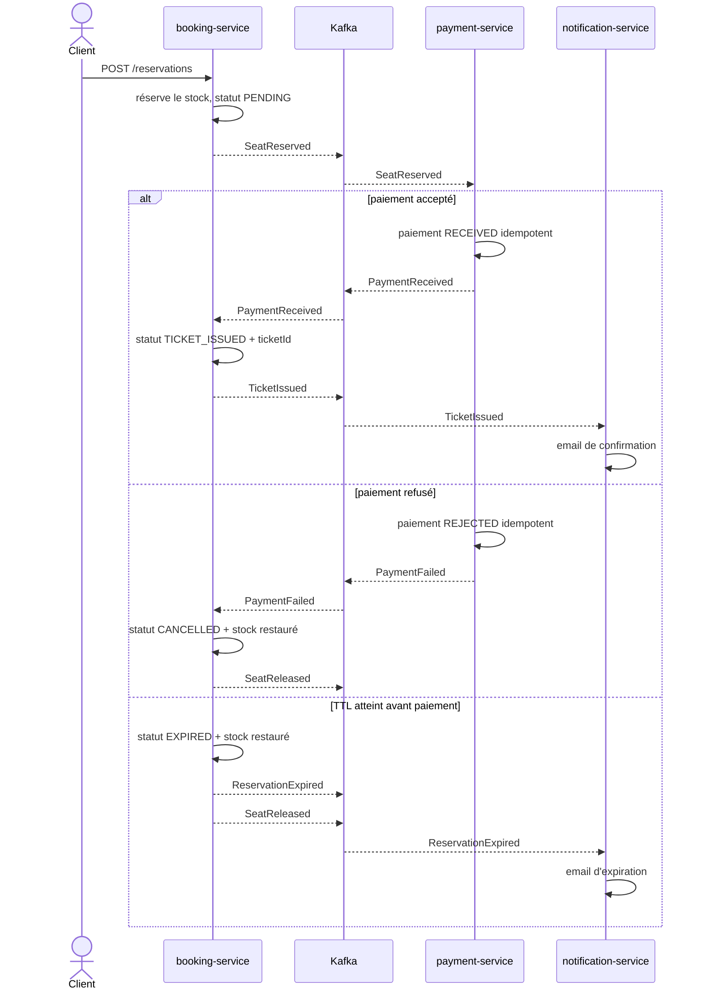
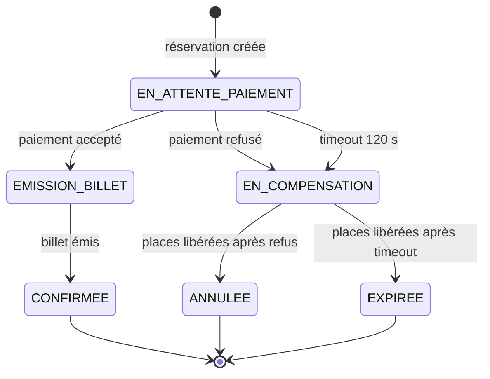

# Saga TickRush

## Saga chorégraphiée réalisée

La réservation est l'agrégat de corrélation. Pour tous les faits de cette saga, la clé Kafka
et `aggregateId` valent `reservationId`; l'identifiant du concert reste dans le payload.



Chaque mutation de `booking-service` est une transaction PostgreSQL locale. Les événements
sont envoyés après commit; le problème de dual-write restant sera supprimé par l'Outbox au
TP07. Les résultats de paiement consommés sont dédupliqués dans `processed_events` au sein
de la même transaction que leur effet métier. Le TTL prend un verrou pessimiste sur la
réservation et la transition d'état empêche toute seconde libération.

## Machine à états d'une version orchestrée



L'orchestrateur persisterait une ligne par réservation dans une table `saga_instances` :
`reservationId`, état, étape courante, échéance, dernière commande, nombre de tentatives et
version. Il ne porterait aucune règle de prix ou de stock; il séquencerait uniquement les
participants.

Les topics de commandes seraient :

| Commande | Topic | Destinataire |
|---|---|---|
| `AuthorizePayment` | `payment.authorize.commands` | payment-service |
| `IssueTicket` | `booking.issue-ticket.commands` | booking-service |
| `ReleaseSeats` | `booking.release-seats.commands` | booking-service |
| `SendTicketNotification` | `notification.send.commands` | notification-service |

Les services répondraient par des faits (`PaymentReceived`, `PaymentFailed`, `TicketIssued`,
`SeatReleased`) corrélés par `reservationId`. Cette version gagnerait une vue unique de
l'avancement, des timeouts persistants et des relances pilotées. Elle ajouterait un composant
à développer et superviser, couplerait le coordinateur à tous les participants et risquerait
de devenir un *god service* si des règles métier y étaient déplacées.

## Démonstration k3s

```bash
task tp6:demo   # succès, compensation mesurée et rejeu idempotent
task tp6:ttl    # expiration accélérée, remise en stock, configuration restaurée
task tp6:chaos  # payment-service indisponible puis reprise automatique
```

Le scénario de compensation affiche le stock avant la réservation, après la remise en vente,
puis après le rejeu du même `PaymentFailed`. Les deux dernières valeurs doivent être égales.
